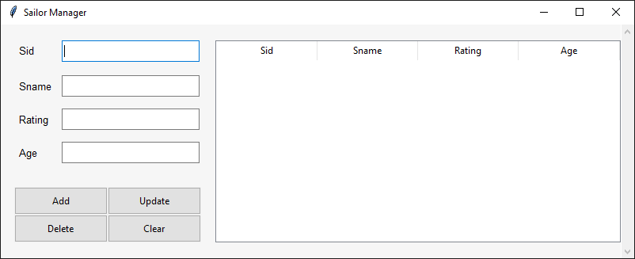

# Sailor Manager - MySQL DBMS implementation in Python.

A simple database application for the following schema

`SAILOR (SID,SNAME,RATING,AGE)`

Sailor relation includes a list of registered sailors. `SID` is the primary key.

### Application features:
- Allows user to insert details of sailors into the database.
-	Allows user to display data of all sailors.
-	Allows user to delete data of one sailor based on SID.
-	Allows user to update data in sailor relation.

### Implementation:
-	The database application is implemented using python.
-	The GUI has been made using `Tkinter` module packaged with python.
-	The module [`pymysql`](https://pypi.org/project/PyMySQL) is used to connect the application with mysql server.

 

